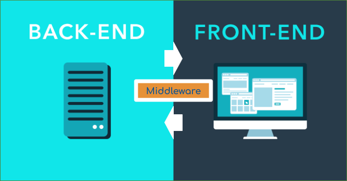
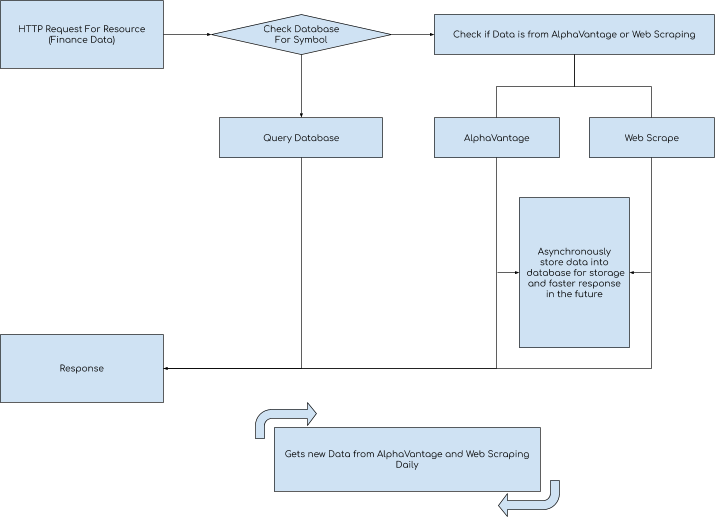
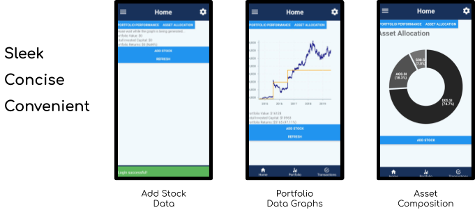

# FinTrack by Team NigerianPrince
Proposed level of achievement: Apollo 11

[Click to view project poster](readme_images/fintrackposter2.png)

## Overview
In 8 weeks, we have developed a Stock Portfolio Tracker for Android users to conveniently track their financial assets and dividend yields, personalised to factor in miscellaneous fees independent of stock value. After several rounds of user testing, this app sports a robust and simple user interface that streamlines the experience to optimize convenience. Users will find that monitoring financial data and their portfolio will always be a few taps away on their mobile device regardless of where they are.

## Motivation

## Feedback Demographic
To have a succinct idea of what potential users really want, we decided to ask traders and potential traders about their feedback and opinions on existing applications and their user experiences with these applications. Considering there are different tiers of trading enthusiast ranging from people who have just started out or planning to start out to veterans who have been trading for several years. Hence we decided to get the feedback of these demographic groups within this spectrum of users.

## User Stories
- As a new investor, I want to check my progress without distractions from clutter such as that of traditional stocktracking apps, so that I can focus on what is important.
- As a long term investor, I want my dividend yield to be tracked together with my stock portfolio as it is a significant part of the total returns.
- As an investor for many months/years, I want data visualisation so that I can better analyse my progress.
- As a frequent trader, I want to track my transaction fees (brokerage etc.) as it directly affects portfolio value.

## Learning Points
From the user stories above, we decided to develop an application that can be used by most traders, and fit in to their needs that are not being satisfied by current applications out there. We determined that we would make a competent application to track portfolios, stock prices and dividend yields together with strong and meaningful data visualisation. We also noticed that the UX of the application was vital, since there were many complaints against existing finance applications, largely directed towards the representation of the data and its navigation. Thus, we also decided that a strong emphasis on the design of the application’s user interface and navigation structure was needed alongside our features.

## Scope of project
The mobile application provides a platform for users to create an account and store their user specific data.
The application will allow users to navigate to several pages, which are mainly, home page, transaction summary page, portfolio summary page, account summary page, news page, settings page.
These pages serve their respective purposes as covered earlier.

## Features
- Track Stock Portfolio Performance
- Real-time Stock Price Tracking
- Track Dividend Yield
- Concise Data Visualisation
- Streamlined User Interface
- Clear and Efficient User Navigation
- Platform: Android

## Choice of platform and future scalability of application
We intend to develop this application for android. Initially, we wanted to develop the application on all mobile devices. However, due to the timeline of Orbital and our level of experience in mobile app development, we decided to limit our platform development to Android. Despite this, we are considering expanding this application to IOS. This leads us to our choice of React Native, to easily scale this application towards IOS.

## Development

## Structure

### Middleware
We decided to use a Representational State Transfer Application Programming Interface (REST API) as a middleware between our Frontend and Backend due to its stateless protocol, which was performance-wise sufficient. We decided to use a REST API also due to its stateless nature which made it easier to test and debug.

### Frontend
Our Frontend would be developed in React Native, which is similar to the popular React Web Framework. The reason for using React Native instead of going native for Android development, as discussed in the previous section, was to allow us to scale it to IOS easily after Orbital.

### Backend
As for our Backend, we decided to use NodeJS runtime environment to script the REST API to our database and other data sources. We determined that our database will a few key sets of information, which are tokens for authentication, user account information and finance data. We decided to store finance data in our own database instead of solely relying on third party sources for reliability and performance as well. Our biggest hurdle is obtaining the finance data, since there is so much volume of data that is consistently and periodically updated. Thus, we had to look for the data to store in our database as well. Hence we decided to primarily use AlphaVantage as our main source of finance data to pull into our own database.

## Authentication
### Choice of JSON Web Tokens (JWTs)
We were contemplating the level of security for this application, since many applications, especially social media apps, allows users to log in once and stay logged in until they explicitly log out. However, on the other hand, applications such as banking apps often require users to undergo authentication and occasionally even 2FA within a short amount of time (less than 30mins typically). We decided that since stock data was not sensitive, the most sensitive data on our application was the user’s portfolio data. We chose to design the authentication such that users can log in, but will only stay logged in with persistent usage of the application, otherwise they will be logged out automatically.

### Strategy
We settled on JSON Web Tokens (JWTs) to authenticate users before they interact with our REST API. Upon logging in, the frontend will receive two JWTs, an access and refresh token. The access token was used to interact with backend and has a very short valid time before it expires (5min). The refresh token was used to get new access tokens and had a longer valid time before it expires (1w). The frontend will interact with the backend using the access token for authentication. Whenever the access token has expired, the application will request a new access token and refresh token to store using its existing refresh token, before carrying on with its original request.

### Why use 2 different tokens (Access vs Refresh)
The combined use of these 2 types of tokens was to facilitate persistent login sessions for users within a given grace period. 

Access tokens are used to interact with the backend, and are set to very short validity periods as a contingency in the event that the token was compromised, limiting the exploited use of a wrongfully obtained access token.

Refresh tokens are used as a frame of reference for keeping track of the ‘grace period’ before the user is logged out due to inactivity. Thus, their validation period is the grace period’s duration which is renewed every time a new access and refresh token is requested. This facilitates the persistence in the login sessions for users whilst keeping a track of inactivity per device.

### Handling explicit log outs
However, we also had to solve the issue of an explicit log out, where we had to expire the access and refresh tokens on demand. The issue we faced was that JWT could not be expired or revoked on demand, thus we decided to store these tokens in a blacklist in our database until they naturally expired, which was not an expensive cost to our database since the tokens naturally expire and would not expand in size indefinitely.

### Frontend Storage of JWTs
All JWTs are stored in React Native’s Secure Storage to ensure that the tokens are well protected on the client side device.

## Database
### Choice of Database
The database we chose to use was MongoDB. We used this NoSQL, document based database as it was flexible and beginner-friendly. We were initially deciding between a relational and non-relational database to store our data. However, after putting some thought into the schema design and infrastructure on how to store our data, we were unsure and afraid that it will undergo major fundamental changes as this was a new project for both of us. Furthermore, we were not formally trained in RDBMS and how to properly normalize the data, thus we chose to go with MongoDB’s NoSQL document based database. It was flexible enough for us to easily remodel our database for performance or structure during the development cycle, potentially due to unforeseen issues or features that we would come up with. MongoDB’s BSON documents was really similar to JSON documents which we both had some prior experience working with, which made it our choice of database as well.

### Utilising ODMs
We used Mongoose, an Object Document Mapper (ODM), to help us model a flexible schema for our collections in MongoDB as there was a need to structure our data, albeit with a degree of flexibility in MongoDB. This helped us manage the data structure with minimal bugs. The overhead from using Mongoose was not significant enough to justify not using it, as we tested querying performance of the database after inserting large amounts of documents. We deemed that the query performance was strong enough that it would not impose on the user’s workflow on the application.

### Strategy

We store our data into mainly user, finance, authentication categories, comprising of up to several collections each. 

For authentication, as mentioned above, we store tokens that are revoked but have yet to expire, setting a ttl field to their natural expiry date. This manages a blacklist of tokens until they naturally expire.

For finance data, that is not tied to a specific user, was stored using size bucketing. We stored the time series data into buckets by year, and since data was updated daily and monthly, each document had strictly less that equal to 365 daily prices and 12 monthly prices. This was to optimize query performance as storing each daily price in a single document would bloat the database and storing all data to a single document would bloat the document size, affecting performance. 

For users, we stored their administrative details in a document securely (discussed in the next sub section), and we stored portfolio and transaction data into several collections. Transactions was a single document tied to each user, portfolio data was stored in another document tied to each user. Portfolio data was logged at intervals and was stored in a separate collection, which used a similar size bucketing design to store the data. We decided to do this for portfolio logging and not for transactions as the portfolio logging was inherently larger in size and due to frequent querying for graph data, it was necessary to optimize it. If our application scales up and we decided not to limit the transaction history size, we will port over all the transaction data into a similar size bucketing design as well.

## User Data
Users are to set up their accounts with our application before use and requires users to input a username, email and password. We guarantee that we do not store plaintext passwords and ensure that passwords are asymmetrically hashed over several rounds before being stored into our database. This is done with bcrypt on npm. This is to protect users and their passwords. We wanted users to have personalised data tied to an account as it a portfolio serves as a form of identity. Furthermore, should the application grow in features, we can always use machine learning to generate user specific data on searches and suggestions using their account specific behaviour. User data would also be (legally) available to collaborate with other finance applications in the future.

## Financial Data
### AlphaVantage
As mentioned earlier, most of our finance data are in large quantities and we store them in size bucketed documents. However, with all this data had to come from somewhere. We used AlphaVantage to get finance data. This allowed us to retrieve comprehensive historical data as early as up to 1998. This allowed us to fetch JSON data from AlphaVantage and store the data into our database.

### Web Scraping
AlphaVantage has a very comprehensive collection of finance data, however, it did not provide the dividends for SG symbols, thus we had to diversify our source of data. We found a reliable source of dividend values of a web service at dividends.sg. We decided to scrape the website for dividends regarding SG symbols. We used Cheerio and Cheerio Table Parser to fetch the page from the dividends.sg and scrape their pages for the prices.

### Strategy

Considering that there was a vast number of symbols available, the amount of data to store would be immense. Furthermore, all this data are updated frequently. This prevented us from just using existing databases trivially. We had to dynamically update our database as required. Since stock data changes in real time, we decided to update our database daily to best provide the latest financial data available.

We knew that it was unlikely to find a data source comprising of all available symbols, hence we decided to let our database grow as we queried it. The backend will get the data from the database if it was stored, and if it was not, it would get it directly from either AlphaVantage or dividends.sg. Then we would asynchronously save the data into our database, allowing a future query on this resource to be quickly obtained from the database afterwards. The database would make use of heroku’s schedulers to schedule scripts to update all the distinct symbols that were stored daily. This allowed the database to keep up to date and dynamically grow in size.

### Data Visualisation
With a huge chunk of data from Alpha Vantage  and our database, we needed a way to process the data such that it is appropriate as input for Victory-Native, the data visualisation library for React Native. Because of the multiple intra-app state mutations passed over amongst the components, we decided to take a more careful approach to data cleaning which is to utilise functional programming methodologies which promotes state immutability, reducing side effects in the long run. The three main functions we use to process data arrays are .filter(), .map() and .reduce().

## UI/UX
The UI and UX are vital to the utility and purpose of this application. After all, it was one of the core complaints that we gathered from our rounds of collating user opinions on this genre of applications. There were several aspects which we took into consideration, whilst designing the UI and UX. Navigation structure and paths for users to take, page layout and utility, color scheme and visuals.

### Navigation Layout
Navigation was important to streamline, as the complexity of existing finance applications can be overwhelming. We settled on the dual use of a minimalistic drawer bar and a bottom tab for users to quickly orientate and move around with. The bottom tab is for the core features that users typically would want to frequently check, the drawer navigation opens up to provide all pages that have lower priority such as account settings and other extensible features.

### Page Functionality

The pages for displaying data are spacious, and neatly aligned into lists. This helps you read and find what you need quickly without straining your eyes. With modern phones have large screen sizes, there was no need to compress data into compact lists. Furthermore with mobile users frequenting their applications at really short intervals throughout the day, it was important to take eye strain and fatigue into account. 

Below are some of the features of the page design and the thought process behind creative choices. The designs are built on layers of several user testing feedback, which will be covered in the later sections.

For pages to input user data such as stock information, as the user keys in their numbers, there is a summarized list of information for user verification and error checking. Graphs are simple and concise, with asset allocation diagrams available for a macro view of users’ portfolios.

### Theme
Eye strain and fatigue of heavy users of mobile devices is also why we chose a light-on-dark contrast on the design instead on dark-on-light. This causes less eye strain on frequent viewing of app on screen. Night mode (dark-on-light) would be a possible extension to this for night use, however it was not a necessary feature that we wanted to include in this time frame.

## User Testing
We provided a previous working version of our application with its core features for some users to test and give their feedback on, so as to see what can be improved, what was working and what was not.

### Feedback
- “Previously the visualisation aspect of the portfolio and capital graph is nice but maybe it is possible to show asset allocation?”
- “The pop up animations on actions like logging in looks neat but can be a bit obstructive and in the way I guess.”
- “Sometimes what I add stocks and click, I feel that there is no way to verify if the app processed my input correctly, or if I accidentally made a mistake in some part of the input. Maybe it’s better to have some form of self validation a user can have to see if what I entered is correct?”

From the testing phase, we could see that there were a few areas of fine tuning to do with our application, especially on user interaction. 

The visualisation aspect of data could be improved by allowing the users to see their asset allocation, this will help them in making decisions regarding their portfolio, such as diversifying their assets. Therefore we implemented this feature to allow this.

The animations was fixed by making notifications disappear automatically. This allows users to power use our application and perform many actions without being gated by the notification obstruction.

We also added an information summary at the bottom of certain screens when users perform actions so that it summarizes their input data, allowing for quick error checking and validation. This helps users feel confident in their data entries and streamline their checking process.

Overall, most of the improvements was UI/UX directed to improve the fluidity of the user’s experience and actions around the application. We hope that the new features would allow users to have a pleasant and efficient experience with our application.

## Road Map
Looking to the future, we have been thinking about the potential extensible fe
atures that this application can aim to achieve. We try to think of features in the perspective of providing useful tools for users (without cluttering and hindering core features) that can benefit and automate mundane or necessary tasks.

### News Feed
We thought that a news feed would be useful to users, comprising of relevant news specific to what the companies whose stocks the user may be currently holding on to. This would be non intrusive, and can be an added page in our application access via the drawer tab. This would let users keep up to date on relevant news without impeding on the workflow of the user. We were thinking of scraping news sites and search engines for producing the data for the news feed.

### Social Network
Social networking has been a very popular genre of mobile application and has generated a sense of necessity in keeping in touch and up to date with our acquaintances, family and friends. Thus, we thought it would be rather neat for users to keep in touch with their fellow investors, keeping up to date with their finance activity or opinions on a social platform. Similar to the news feed, this is an additional page via the drawer tab, unobstructing the workflow of the core features of the application. We were contemplating that this could either be done via our own graph networks, or utilising an existing social media such as Facebook or Twitter.

## Built with
- [React Native](https://facebook.github.io/react-native/)
- [Node.js](https://nodejs.org/en/)
- [MongoDB](https://www.mongodb.com)
- 

## Authors
- Keith Teo [@keiteo](https://github.com/keiteo)
- Marc Fong [@marcfyk](https://github.com/marcfyk)
